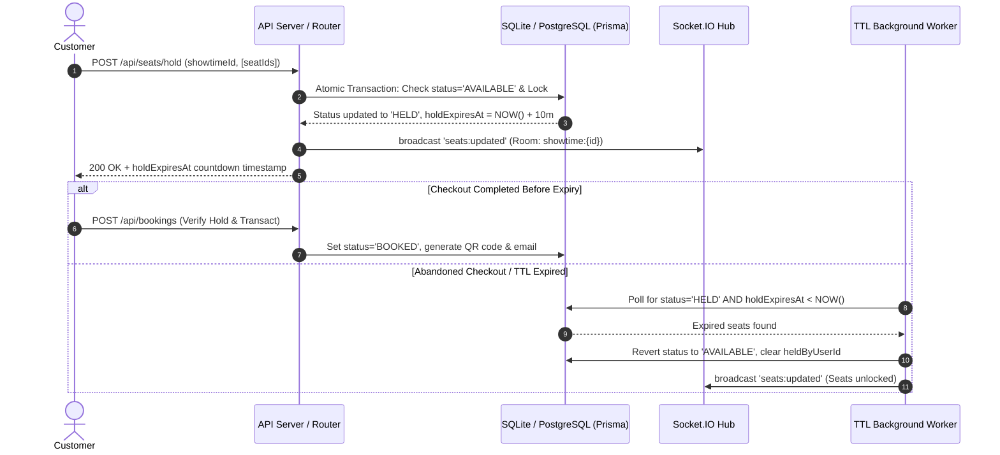
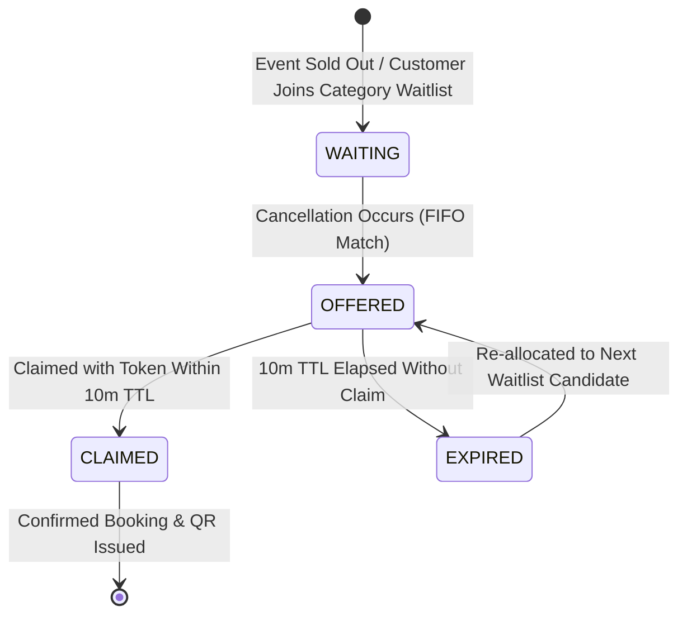

# System Design Document: High-Demand Ticket Booking Platform

## 1. Executive Summary & Problem Context
High-demand event ticketing systems (e.g. blockbuster movie premieres, major stadium concerts) face extreme concurrency spikes where thousands of customers compete for identical inventory in sub-second windows. Without robust engineering, this causes race conditions (double-booking), abandoned checkouts holding scarce inventory indefinitely, and cancellation inefficiencies. This platform provides an end-to-end distributed architecture addressing concurrency, TTL-based seat reservation, FIFO category waitlists, real-time visual seat map synchronization, and QR ticket verification.

---

## 2. Seat Hold TTL & Auto-Release Mechanism

### Hold Architecture:
1. **Configurable TTL**: Each showtime carries a `holdTtlMinutes` property (default 10 minutes).
2. **Dual-Layer Expiry Validation**:
   - **Lazy Evaluation**: On any seat read (`GET /api/showtimes/:id/seats`), seats where `status = 'HELD'` and `holdExpiresAt < NOW()` are immediately sanitized and rendered as `AVAILABLE` to the requesting client.
   - **Active Background Sweep**: A dedicated background cron worker (`startTtlWorker`) executes every 10 seconds to scan for expired holds across all venues, atomically transitions them back to `AVAILABLE`, and emits WebSocket payloads to instantly update connected seat map grids in real time.

---

## 3. Concurrency Protection & Race-Condition Elimination
To prevent two or more users from holding or booking the same seat simultaneously:
- **Interactive Database Isolation**: All hold operations execute inside `prisma.$transaction`.
- **Condition Matching & Atomic Update**: The query checks `status = 'AVAILABLE'` (or held by the same user with unexpired TTL). If any seat is booked or held by a competing user, the transaction aborts with HTTP `409 Conflict` and identifies the contested seat numbers.
- **Optimistic Version Counter**: Every `ShowSeat` row possesses an integer `version` field incremented atomically on every mutation.
- **Simulated Verification**: Our automated load script (`npm run test:concurrency`) submits 10 concurrent requests for the exact same seat within the same millisecond. Exactly 1 request acquires the hold lock while 9 are deterministically rejected.

---

## 4. FIFO Waitlist Auto-Assignment & Time-Limited Offer Flow

### The Auto-Reallocation Lifecycle:
1. **Waitlist Entry**: When a seat tier (e.g. VIP) sells out, customers join a FIFO queue for `showtimeId` + `category` (or `ANY`).
2. **Cancellation Hook**: When a confirmed booking is cancelled via `POST /api/bookings/:id/cancel`:
   - For each freed seat, the waitlist engine queries the oldest `WaitlistEntry` with status `WAITING`.
   - If a candidate exists, a cryptographically secure `claimToken` is generated.
   - The seat transitions to `HELD` exclusively for this customer with `offerExpiresAt = NOW() + 10m`.
   - The waitlist status changes to `OFFERED`, and an instant notification email containing a one-click claim URL (`/waitlist/claim/:claimToken`) is dispatched.
3. **Escalation / Expiry**: If the candidate fails to claim within the 10-minute window, the background worker marks the entry `EXPIRED` and passes the reservation to the subsequent candidate in line. If the waitlist is empty, the seat reverts to `AVAILABLE`.

---

## 5. Real-Time Seat Map Data Model & WebSockets
- **Hierarchical Layout Model**:
  - `Venue` defines dimensions (`totalRows`, `totalCols`).
  - `VenueSeat` defines persistent physical topology and tier categories (`VIP`, `PREMIUM`, `STANDARD`).
  - `ShowSeat` tracks dynamic per-showtime state (`AVAILABLE`, `HELD`, `BOOKED`, `heldByUserId`, `holdExpiresAt`).
- **Live WebSocket Channels**:
  - Clients join `showtime:{showtimeId}` room upon loading the seat map.
  - State changes (`hold`, `release`, `book`, `cancel`) broadcast incremental seat diffs.

---

## 6. QR Code Generation & Ticketing Delivery
- On checkout confirmation, a high-error-correction QR code (`QRCode.toDataURL`) encodes `{ bookingRef, showtimeId, eventTitle, seats, customerEmail, timestamp }`.
- Nodemailer sends an HTML ticket embedding the QR image and summary details, with test account preview link support for staging and local development.
